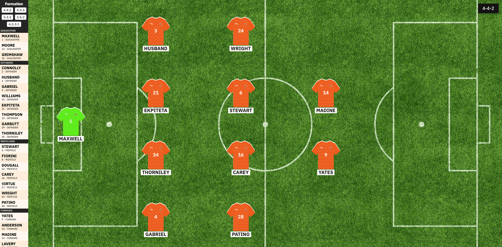

# Football Team Picker App
This is a football team picker app I wrote in HTML, SASS and JavaScript ES6.

Youtube screencast demo here: https://youtu.be/AuD_IHwdJCw 

## What is does do?

It allows a football fan to select his chosen starting eleven players for a football team, as long as its Blackpool FC 😜  

NB - It's on the roadmap to expand this to other teams. 

## Why I wrote it

To scratch my own itch.  I wanted to solve a problem I was experiencing when streaming my Seasiders Podcast match preview show on YouTube.  

A section of a match preview show was where we picked our preferred team for the next match.  I wanted to use a team picker app viewed at landscape orientation as it's easier to view on a 16:9 video stream.  I tried multiple different apps and they were all based on portrait orientation, so I decided to make one myself and solve my own problem!  

## How I wrote and deployed it

I wrote the application in plain ol' vanilla JavaScript using some ES6 features (and the drag and drop API), JSON, HTML and SASS.  The app itself is hosted in this GitHub repo and deployed onto Netlify.  Linky below:

https://team-picker.netlify.app/
